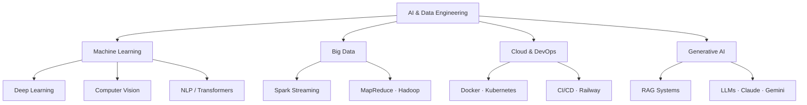

<!-- typing SVG -->

---

<!-- bio -->

**Thierno Daouda Ly**

Computer Science & AI Engineering student at EPT (GIT dept.), Dakar.
Interested in AI/ML, RAG systems, Big Data pipelines, and cloud-native deployments.
Open to research internships and AI/Data engineering roles.

📍 Dakar, Sénégal &nbsp;·&nbsp; 🎓 EPT — Génie Informatique & Télécommunications

 

---

<!-- skills -->
### Skills

| Domain | Stack |
|---|---|
| **AI / ML** |     |
| **Generative AI / RAG** |     |
| **Big Data** |    |
| **Cloud / DevOps** |    |
| **Languages** |     |
| **Frameworks** |    |

---

<!-- stats -->
### GitHub Stats

| | |
|---|---|
|  |  |

---

<!-- snake -->
### Contribution Graph

---

<!-- projects -->
### Featured Projects

<table>
  <tr>
    <td width="50%">
      <h4><a href="https://github.com/thiernodaoudaly/finscope-rag">FinScope RAG</a></h4>
      
Multimodal RAG system for financial report analysis — Claude Vision · BGE-M3 · OpenSearch hybrid search · 84.4% RAGAS score · Built for Sonatel's Finance & HR division.

      

        
        
        
      

    </td>
    <td width="50%">
      <h4><a href="https://github.com/thiernodaoudaly/graphlens">GraphLens</a></h4>
      
Django web app for data table lineage & metadata management backed by Neo4j — built at Sonatel's Data/AI Business Management department.

      

        
        
        
      

    </td>
  </tr>
  <tr>
    <td width="50%">
      <h4><a href="https://github.com/thiernodaoudaly/artify">Artify</a></h4>
      
PyTorch implementation of Neural Style Transfer (Gatys et al. 2016) — VGG19 feature extraction, Gram matrix style loss, L-BFGS optimisation, Streamlit web app.

      

        
        
        
      

    </td>
    <td width="50%">
      <h4><a href="https://github.com/thiernodaoudaly/tontuma">Tontuma</a></h4>
      
Streamlit VQA app powered by ViLT — upload an image, ask a question, get an instant answer. "Tontu ma" means "show me" in Wolof.

      

        
        
        
      

    </td>
  </tr>
  <tr>
    <td width="50%">
      <h4><a href="https://github.com/thiernodaoudaly/ai-vs-human-text">TextDetect</a></h4>
      
Django web app that classifies text as AI-generated or human-written — Logistic Regression + TF-IDF + spaCy feature engineering, trained on 260K samples.

      

        
        
        
      

    </td>
    <td width="50%">
      <h4><a href="https://github.com/thiernodaoudaly/smartquery">SmartQuery</a></h4>
      
Voice-enabled AI desktop assistant — Google STT + PaLM API + pyttsx3 TTS, Markdown responses rendered in Tkinter via tkhtmlview, multithreaded UI.

      

        
        
        
      

    </td>
  </tr>
</table>

---

<!-- mermaid -->
### AI / Data Landscape

---

<!-- contact -->
### Contact

  
  &nbsp;&nbsp;
  
  &nbsp;&nbsp;
  

  

