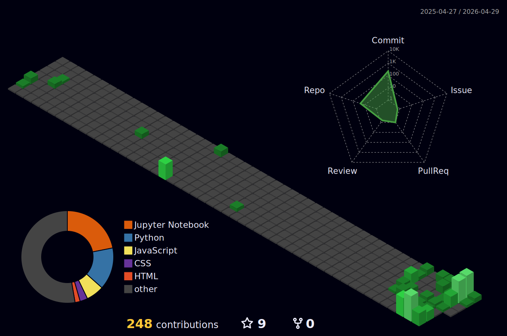

<!-- header -->

  

---

<!-- bio -->

**Hi, I am Tcherno**

Final year Computer Science Engineering student at Ecole Polytechnique de Thiès (EPT), Senegal.
Interested in AI/ML, RAG systems, Big Data pipelines, and cloud-native deployments. I am currently seeking opportunities as an AI Engineer, Machine Learning Engineer, Cloud Data Engineer, or in research-oriented AI environments.

<!--   -->

---

<!-- skills -->
### Skills

| Domain | Stack |
|---|---|
| **Artificial Intelligence** |          |
| **Languages** |     |
| **ML Frameworks** |       |
| **Technologies & Frameworks** |         |
| **Cloud & DevOps** |        |
| **Big Data** |     |
| **Databases** |       |
| **Soft Skills** |         |

---

<!-- stats -->
### GitHub Stats

| | |
|---|---|
|  |  |

 

<!-- snake 

  

  
  

  

-->

<!-- 3D profile -->
### 3D Contribution Graph

---

<!-- Views --> 
### Profile Views

*Visits counted from April 2025*

### Connect with me

&nbsp;&nbsp;&nbsp;&nbsp; 